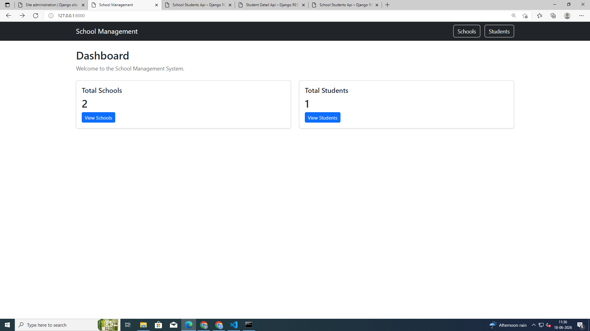
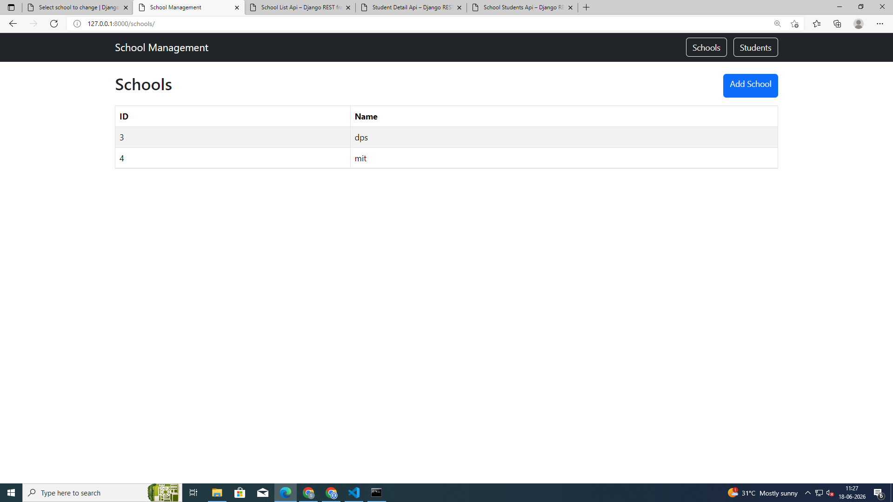
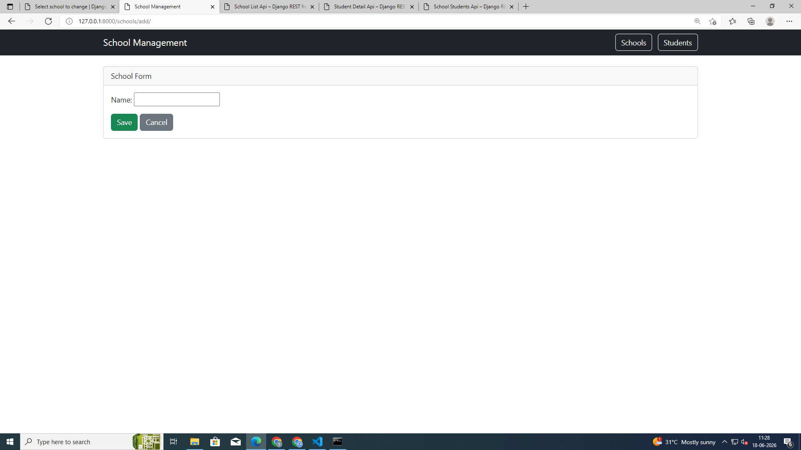
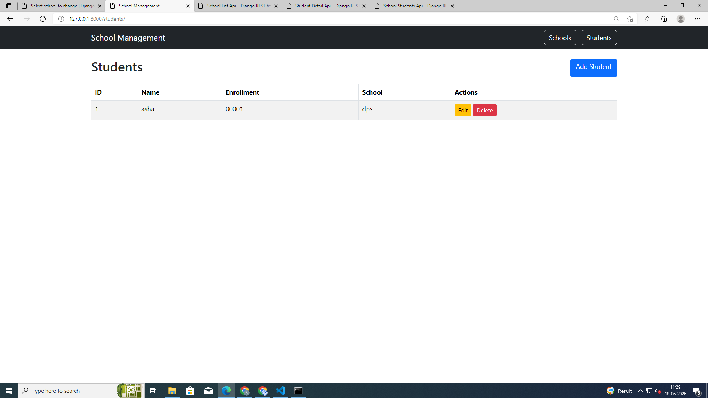
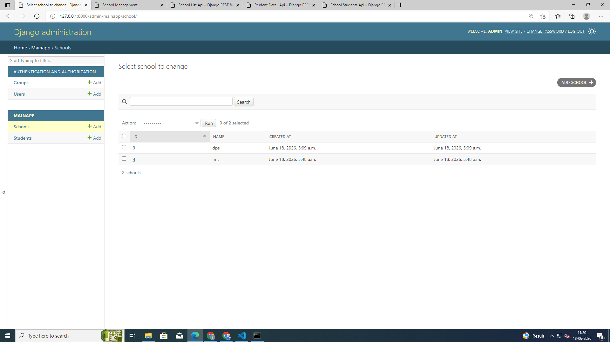
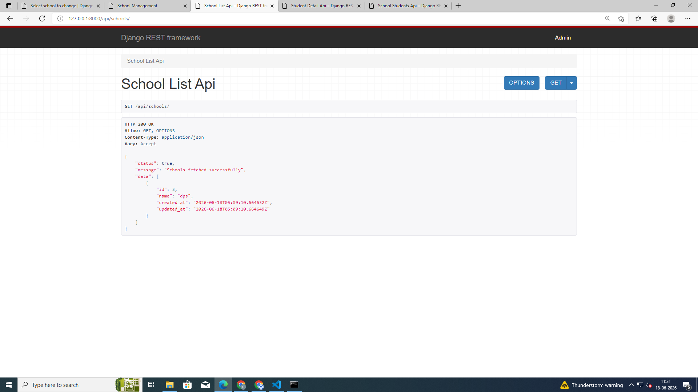
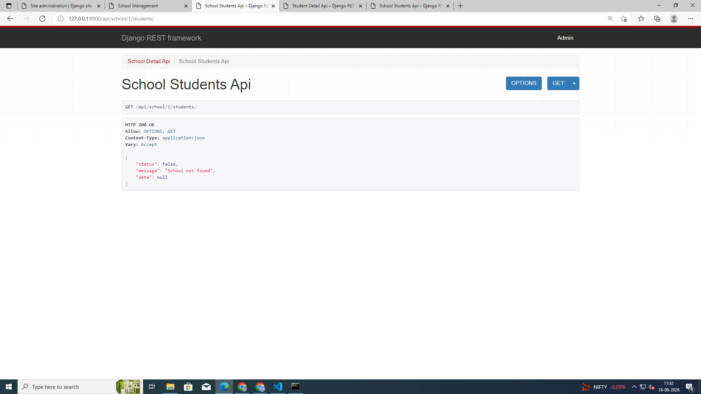

# School Management System

A Django-based School Management System developed using Django, Django REST Framework, Bootstrap, and AJAX. The application allows users to manage schools and students, perform CRUD operations, and access REST APIs for retrieving school and student information.

## Screenshots

### Dashboard



### Schools Page




### Students Page



### Admin Panel



### API Response




## Features

### School Management

* Create, view, update, and delete schools
* Bootstrap-based user interface
* Admin panel support

### Student Management

* Create, view, update, and delete students
* Unique enrollment number validation
* School-wise student mapping using Foreign Keys

### REST APIs

* Get School Details
* Get Student Details
* Get School with Associated Students
* Standardized API response format

### AJAX Integration

* Dynamic school listing using AJAX
* JSON-based data retrieval without page refresh

### Django Admin

* Custom admin configuration
* Search functionality
* List filters
* Customized display columns

---

## Technologies Used

* Python
* Django
* Django REST Framework
* Bootstrap 5
* JavaScript (AJAX / Fetch API)
* SQLite

---

## Database Design

### School Model

| Field      | Type          |
| ---------- | ------------- |
| id         | AutoField     |
| name       | CharField     |
| created_at | DateTimeField |
| updated_at | DateTimeField |

### Student Model

| Field      | Type               |
| ---------- | ------------------ |
| id         | AutoField          |
| name       | CharField          |
| enrollment | CharField (Unique) |
| school     | ForeignKey         |
| created_at | DateTimeField      |
| updated_at | DateTimeField      |

---

## API Endpoints

### Get School Details

```http
GET /api/school/<id>/
```

### Get Student Details

```http
GET /api/student/<id>/
```

### Get School With Students

```http
GET /api/school/<id>/students/
```

### Get All Schools (AJAX)

```http
GET /api/schools/
```

---

## Sample API Response

```json
{
    "status": true,
    "message": "School fetched successfully",
    "data": {
        "id": 1,
        "name": "MIT"
    }
}
```

---

## Setup Instructions

### Clone Repository

```bash
git clone <repository-url>
cd school_management
```

### Create Virtual Environment

```bash
python -m venv venv
```

### Activate Environment

Windows:

```bash
venv\Scripts\activate
```

### Install Dependencies

```bash
pip install django djangorestframework
```

### Run Migrations

```bash
python manage.py migrate
```

### Create Superuser

```bash
python manage.py createsuperuser
```

### Run Project

```bash
python manage.py runserver
```

---

## Future Improvements

* Student search functionality
* AJAX integration for student listing
* Pagination
* Authentication and authorization
* Dashboard analytics

---

## Author

Sania Nixon
